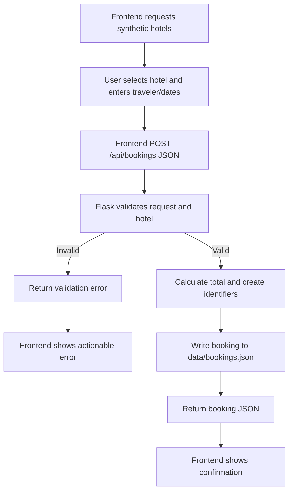
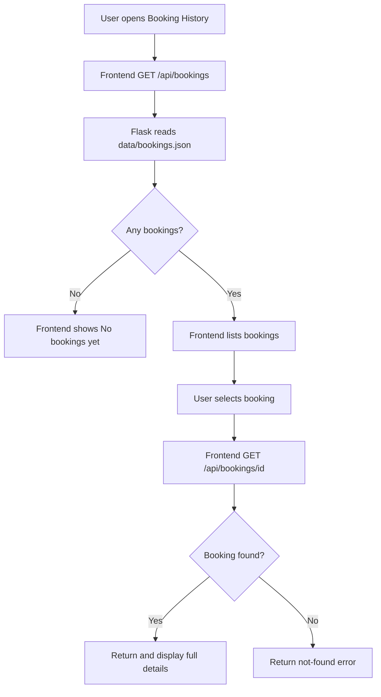

# Part 1 Design: Local Hotel Booking Application

## 1. Reference application

The application is broadly inspired by [Expedia](https://www.expedia.com/) as a familiar travel-booking reference. This project does not copy Expedia, connect to Expedia, use Expedia data, or use private Expedia information. It is a small local application with synthetic hotel and traveler data.

## Visual reference materials

The supplied screenshots in `docs/reference-images/` are observable references to Expedia at [https://www.expedia.com/](https://www.expedia.com/). They are used only to inform high-level interface ideas for this course project. This project does not copy Expedia's proprietary code or data, and it does not claim to reproduce Expedia's interface exactly.

### Expedia search/results reference

`docs/reference-images/expedia-search.png` documents an Expedia hotel search-results view. The future local interface may take inspiration from the information hierarchy visible in such a view: presenting search information, showing hotel result cards, and making each card's hotel name, price, rating, and selection action easy to find. These are planned usability ideas only; this project will use its own simplified interface and synthetic hotel data.

### Expedia trip-history reference

`docs/reference-images/expedia-trips.png` documents an Expedia booking/trip-history view. The future local interface may take inspiration from organizing stored booking information into booking history and providing a clear way to view reservation details. These are planned information-organization ideas only; this project will use its own simplified interface and synthetic booking data.

## 2. Scope

The future application supports only two connected hotel-booking flows: creating a hotel booking and reviewing saved booking history/details. It will not implement real payments, authentication, real booking APIs, flights, rental cars, or real traveler data.

## 3. Four-layer decomposition

| Layer | Planned components and responsibilities |
| --- | --- |
| Interface | Implemented: a basic hotel-name search form, count, and results table. Planned: hotel selection, booking form, confirmation view, history list, detail view, and messages for loading/errors. |
| Logic | Implemented: browser-side, case-insensitive filtering of synthetic hotels by name. Planned: Flask request handlers, validation, hotel lookup, night/total calculation, ID and confirmation-number generation, and response shaping. |
| Data | Implemented: three synthetic hotel records embedded in `frontend/app.js`. Planned: submitted traveler data and booking records using the model below. |
| Persistence | Planned: read/write `data/bookings.json` so bookings remain after frontend and Flask restarts. Deleting the file removes the stored history. The current search prototype does not read or write this file. |

### Implemented Part 1 starter prototype

`frontend/index.html`, `frontend/styles.css`, and `frontend/app.js` provide a deliberately small classroom-style hotel-search prototype. It renders three synthetic hotel records and filters the displayed table by hotel name after the user selects Search. It is standalone browser JavaScript: it makes no HTTP requests and has no Flask connection, booking form, booking confirmation, booking history, or persistent storage.

## Data model

| Entity | Fields |
| --- | --- |
| Hotel | `id`, `name`, `city`, `nightlyPrice`, `rating` |
| Traveler | `firstName`, `lastName`, `email` |
| Booking | `id`, `confirmationNumber`, `hotel`, `checkIn`, `checkOut`, `traveler`, `totalPrice`, `createdAt` |

`Booking.hotel` will contain the selected synthetic hotel object, and `Booking.traveler` will contain the submitted traveler object. Dates should use a consistent machine-readable format such as ISO `YYYY-MM-DD`; `createdAt` should be an ISO timestamp.

## 4. Flow 1: Make a Booking

1. The frontend requests synthetic hotel results with `GET /api/hotels`.
2. The user selects a hotel and provides first name, last name, email, check-in date, and check-out date.
3. The frontend sends the selected hotel ID and form data as JSON to `POST /api/bookings`.
4. The backend validates required values, checks that check-out is after check-in, and verifies the hotel ID.
5. For a valid request, the backend calculates nights and total price, creates a booking ID and simulated confirmation number, and saves the booking to `data/bookings.json`.
6. The backend returns the saved booking as JSON; the frontend displays confirmation details.

## 5. Flow 2: Review Booking History

1. The user opens Booking History.
2. The frontend requests records with `GET /api/bookings`.
3. The backend reads saved bookings from `data/bookings.json` and returns them as JSON.
4. The frontend shows a list or a “No bookings yet” message.
5. When the user selects a record, the frontend requests `GET /api/bookings/<id>`.
6. The backend finds and returns the full booking or returns a not-found response.
7. The frontend displays details or an understandable error.

## 6. Step-to-layer responsibility map

| Major step | Interface | Logic | Data | Persistence |
| --- | --- | --- | --- | --- |
| Show hotel results | Renders results and selection controls | Serves hotel collection | Synthetic hotel records | None required initially |
| Submit booking | Collects input and sends JSON | Validates, finds hotel, calculates, creates identifiers | Hotel and traveler values | Writes booking record |
| Show confirmation | Renders returned booking | Returns saved booking | Booking fields | Booking has been stored |
| Load history | Requests and renders list/empty state | Retrieves collection | Booking records | Reads JSON file |
| Show details | Requests and renders one booking | Finds record or returns 404 | Full booking record | Reads JSON file |

## 7. Meaningful failure states

### Booking creation

| Condition | Planned backend behavior | Planned frontend behavior |
| --- | --- | --- |
| Missing traveler name | Reject request with field-specific validation error | Identify the required name field(s) to the user. |
| Missing email | Reject request with validation error | Ask the user to enter email. |
| Missing check-in date | Reject request with validation error | Ask the user to choose check-in. |
| Missing check-out date | Reject request with validation error | Ask the user to choose check-out. |
| Check-out is not after check-in | Reject request with validation error | Explain that checkout must be later than check-in. |
| Hotel ID does not exist | Reject request with not-found/validation error | Explain that the selected hotel is unavailable and prompt reselection. |
| Backend unavailable | No response can be provided | Show a clear connection error and allow retry. |

### Booking history and details

| Condition | Planned behavior |
| --- | --- |
| No bookings yet | `GET /api/bookings` returns an empty collection; UI displays “No bookings yet.” |
| Booking ID not found | Detail endpoint returns a not-found response; UI explains that the booking no longer exists or cannot be found. |
| Backend unavailable | UI displays a connection/retry message instead of misleading empty history. |

## 8. How the pieces work together

The frontend owns the user experience and sends JSON via `fetch()`. Flask owns the business rules so the browser cannot independently decide whether a request is valid or what its total should be. Flask reads synthetic hotel data, transforms a valid request into a complete booking record, and persists the record. The JSON file is the source of saved booking history and allows data to remain when the browser or backend is restarted.

## 9. Why the backend has a meaningful role

The backend is more than a pass-through: it is the central authority for valid bookings. It verifies required fields and date order, confirms that hotel IDs exist, calculates totals from trusted nightly prices, generates booking identifiers and simulated confirmation numbers, and controls disk persistence and retrieval. This keeps rules consistent across current and future frontend screens.

## 10. Delivery-state distinction

| State | Contents |
| --- | --- |
| Planned | Architecture, flows, data model, endpoints, validation rules, UI states, and Part 2 implementation prompts documented here. |
| Implemented | Part 1 repository structure, documentation, reference images, `.gitignore`, an empty `data/bookings.json` array, and a basic static frontend that filters three synthetic hotels by name. |
| Not yet implemented | Flask application, dependencies, endpoints, API hotel data responses, booking validation logic, booking calculations, IDs/confirmation numbers, booking/confirmation/history/detail screens, `fetch()` calls, persistence read/write code, and browser/API testing. |
