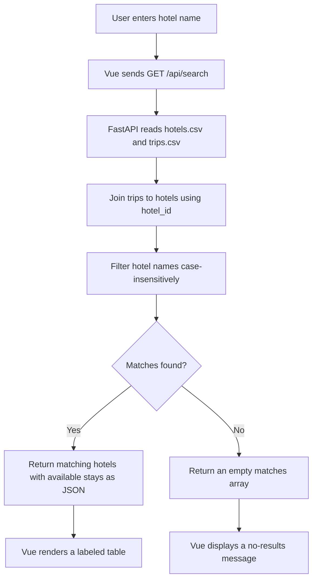

# Part 1 Design: Vue and FastAPI Hotel Search

## 1. Purpose and reference

This Part 1 application is a local hotel and available-stay search. [Expedia](https://www.expedia.com/) and the screenshots in `docs/reference-images/` are observable references for information hierarchy only. The project does not copy Expedia proprietary code, private data, or reproduce its interface exactly.

- [Expedia search reference](reference-images/expedia-search.png) informs the placement of search information and hotel results.
- [Expedia trips reference](reference-images/expedia-trips.png) informs the grouping of stored trip-style information and reservation details.

## 2. Part 1 scope

The implemented scope is a hotel-name search. The user submits a name, sees matching hotels and their available stays in a plain table, or sees a clear no-results message.

Out of scope: SQLite, CRUD, booking creation, confirmation, booking history, authentication, payments, and external APIs. These are not implemented by this Part 1 repository.

## 3. Architecture and responsibilities

| Layer | Implemented responsibility |
| --- | --- |
| Interface | Vue search input, Search button, status/no-results message, and results table with labeled hotel and stay columns. |
| Logic | FastAPI normalizes a hotel-name query, reads both CSV files, joins rows using `hotel_id`, filters hotels by name, and shapes JSON results. |
| Data | Instructor-supplied `hotels.csv` and `trips.csv`. No hotel result data is stored in Vue source. |
| Communication | Browser `fetch()` calls FastAPI over local HTTP; FastAPI returns JSON. |

## 4. CSV data model and join

`data/hotels.csv` has `hotel_id`, `hotel_name`, `city`, `state`, and `nightly_rate_usd`.

`data/trips.csv` has `trip_id`, `hotel_id`, `trip_name`, `check_in`, and `check_out`.

FastAPI reads both files with UTF-8 BOM handling and groups trip rows by `hotel_id`. A matching hotel response contains its own hotel fields plus an `available_stays` collection formed from the joined trip rows.

## 5. Search flow

## 6. API contract

### `GET /api/search?hotel_name=<name>`

- **Input:** a non-empty `hotel_name` query parameter.
- **Output:** JSON with `search_term` and `matches`.
- **Each match:** hotel ID, name, city, state, nightly rate, and joined `available_stays` containing trip ID, name, check-in, and check-out.

## 7. User-visible states

| State | Expected interface behavior |
| --- | --- |
| Empty input | Prompt the user to enter a hotel name before searching. |
| Matching search | Show the number of matching hotels and a table containing hotel and available-stay details. |
| No results | Show `No hotels and available stays found for “<search term>”.` |
| Backend unavailable or invalid CSV | Show the API error message rather than presenting stale or invented results. |

## 8. Verification plan

The student must manually inspect the changed files in VS Code and perform two browser searches after starting FastAPI and Vue:

| Test | Search term | Expected result | Observed result |
| --- | --- | --- | --- |
| Successful search | `Harbor Lantern Hotel` | `H001` appears with two stays: *Boston Harbor Weekend* and *Boston Autumn Weekend*. | Pending manual browser test. |
| No-results search | `Moonlight Palace Hotel` | The clear no-results message appears and no results table is shown. | Pending manual browser test. |

The same expected/observed record is maintained in `docs/evidence-log.md`.

## 9. Current state and next boundary

Implemented: Vue/Vite frontend source, FastAPI endpoint source, CSV reads, `hotel_id` join logic, plain table rendering, and no-results handling. Automated FastAPI HTTP checks and a temporary Vue/Vite production build passed.

Not yet implemented: project-local dependency installation, manual browser verification, SQLite storage, CRUD, and all booking behavior. Part 2 work must not begin until explicitly authorized.
