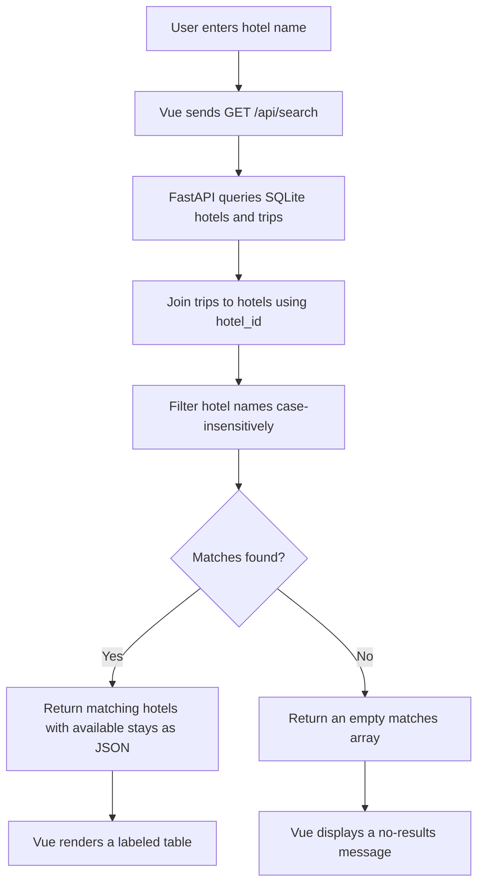

# Part 2 Foundation Design: Vue, FastAPI, and SQLite

## 1. Purpose and reference

This Part 1 application is a local hotel and available-stay search. [Expedia](https://www.expedia.com/) and the screenshots in `docs/reference-images/` are observable references for information hierarchy only. The project does not copy Expedia proprietary code, private data, or reproduce its interface exactly.

- [Expedia search reference](reference-images/expedia-search.png) informs the placement of search information and hotel results.
- [Expedia trips reference](reference-images/expedia-trips.png) informs the grouping of stored trip-style information and reservation details.

## 2. Current scope

The implemented scope is a hotel-name search. The user submits a name, sees matching hotels and their available stays in a plain table, or sees a clear no-results message.

Implemented in this milestone: SQLite schema creation, one-time instructor CSV seeding, SQLite-backed search, booking CRUD API routes, the Vue booking interface, and an Assignment 2 Part 1 ZIP-code hotel map. The map calls Geoapify only through FastAPI, verifies a five-digit U.S. ZIP result, and displays up to 20 nearby provider hotels within 5 km. Authentication, payments, and Assignment 2 Part 2 shortlist functionality remain out of scope.

## 3. Architecture and responsibilities

| Layer | Implemented responsibility |
| --- | --- |
| Interface | Vue traveler selector, hotel-name search, ZIP input, nearby-hotel list, Leaflet map, Book buttons for returned trips, status messages, and booking-history table with Cancel and Delete (test) actions. The ZIP list and markers share `selectedPlaceId`. |
| Logic | FastAPI initializes SQLite at startup, searches joined hotel/trip rows, creates, reads, cancels, or deletes booking rows, and coordinates the server-side Geoapify geocoding/Places requests. |
| Data | Instructor-supplied hotel, trip, user, and booking CSV files seed SQLite once. No hotel result data is stored in Vue source. |
| Communication | Browser `fetch()` calls FastAPI over local HTTP; FastAPI returns JSON. |

## 4. SQLite data model and seed source

`data/hotels.csv` has `hotel_id`, `hotel_name`, `city`, `state`, and `nightly_rate_usd`.

`data/trips.csv` has `trip_id`, `hotel_id`, `trip_name`, `check_in`, and `check_out`; `trips.hotel_id` references `hotels.hotel_id`.

`data/users.csv` has `user_id` and `display_name`. `data/bookings.csv` has `booking_id`, `user_id`, `trip_id`, `booked_on`, and `status`; bookings reference users and trips.

FastAPI reads the CSV files with UTF-8 BOM handling only during the initial seed. A `seed_metadata` marker prevents reloads on later backend starts. `booking_id_state` keeps the highest issued booking number, so deleted test-booking IDs are not reused. Search requests use the persistent SQLite tables, and a matching response contains a hotel's fields plus an `available_stays` collection formed from joined trip rows.

## 5. Search flow

```mermaid
flowchart TD
  A[User enters hotel name] --> B[Vue sends GET /api/search]
  B --> C[FastAPI queries SQLite hotels and trips]
  C --> D[Join trips to hotels using hotel_id]
  D --> E[Filter hotel names case-insensitively]
  E --> F{Matches found?}
  F -->|Yes| G[Return matching hotels with available stays as JSON]
  G --> H[Vue renders a labeled table]
  F -->|No| I[Return an empty matches array]
  I --> J[Vue displays a no-results message]
```

## 6. API contract

### `GET /api/search?hotel_name=<name>`

- **Input:** a non-empty `hotel_name` query parameter.
- **Output:** JSON with `search_term` and `matches`.
- **Each match:** hotel ID, name, city, state, nightly rate, and joined `available_stays` containing trip ID, name, check-in, and check-out.

### `GET /api/nearby-hotels?zip_code=<five-digit-zip>`

- **Input:** exactly five ASCII digits. Leading zeros are preserved.
- **Controller:** reads `GEOAPIFY_API_KEY` only from local backend configuration, geocodes with `countrycode:us` and `type=postcode`, and verifies the matching U.S. postcode before calling Places.
- **Provider search:** `accommodation.hotel` inside a fixed 5,000-metre circle centered on the verified geocode; request/display limit 20.
- **Output:** a safe outcome plus honest provider fields when available: provider place ID, hotel name, address/location, latitude, and longitude. It does not fabricate price, rating, availability, or booking information.
- **Outcomes:** `success`, `invalid_zip`, `unresolved_zip`, `no_results`, `api_failure`, `authentication_failure`, `rate_limited`, and `configuration_error`.

### Booking API

- `GET /api/users` returns SQLite users for the traveler selector.
- `POST /api/bookings` accepts an existing `user_id` and `trip_id`, generates a unique `B`-prefixed ID, uses today's date, and defaults status to `confirmed`.
- `GET /api/bookings` returns history joined to user, trip, and hotel details.
- `PATCH /api/bookings/{booking_id}/cancel` changes only the status to `cancelled`.
- `DELETE /api/bookings/{booking_id}` removes an application-created test booking; instructor bookings `B001`–`B006` return `403` and have no Delete control in Vue.

Missing users, trips, or bookings return `404`; blank create identifiers return `422`.

## 7. User-visible states

| State | Expected interface behavior |
| --- | --- |
| Empty input | Prompt the user to enter a hotel name before searching. |
| Matching search | Show the number of matching hotels and a table containing hotel and available-stay details. |
| No results | Show `No hotels and available stays found for “<search term>”.` |
| Booking created | Show the generated booking ID and refresh booking history from FastAPI. |
| Booking cancelled | Keep the booking row and display `cancelled` after refreshing history. |
| Test booking deleted | Remove the row only after the API confirms deletion, then refresh history. |
| Backend unavailable | Show the API error message rather than presenting stale or invented results. |
| Invalid ZIP | Show a clear five-digit input message before calling the backend. |
| Unresolved ZIP | Show that Geoapify did not resolve the requested U.S. ZIP; do not call Places. |
| Nearby map result | Show the same provider hotels in a keyboard-operable list and Leaflet markers; selected list/marker state stays synchronized. |
| No nearby hotels | Show a provider empty-result message and keep it distinct from an API error. |
| Provider failure | Show a safe authentication, rate-limit, configuration, or generic request-failure message without exposing the key. |

## 8. Verification plan

The student must manually inspect the changed files in VS Code and perform two browser searches after starting FastAPI and Vue:

| Test | Search term | Expected result | Observed result |
| --- | --- | --- | --- |
| Successful search | `Harbor Lantern Hotel` | `H001` appears with two stays: *Boston Harbor Weekend* and *Boston Autumn Weekend*. | Passed in browser: `T001` and `T009` displayed with Book buttons. |
| No-results search | `Moonlight Palace Hotel` | The clear no-results message appears and no results table is shown. | Passed in browser: the clear no-results message displayed. |

The same expected/observed record is maintained in `docs/evidence-log.md`.

## 9. Current state and next boundary

Implemented: Vue/Vite frontend source, FastAPI search and booking CRUD routes, a SQLite schema, one-time CSV seeding, SQLite `hotel_id` join logic, plain table rendering, traveler selection, booking history, cancellation, test deletion, and the ZIP-code Geoapify hotel-map feature. Browser tests passed for create, refresh persistence, cancellation, deletion, restart persistence, initial map rendering/attribution, and invalid-ZIP feedback. Focused backend tests simulate provider empty, failure, authentication, and rate-limit outcomes without spending provider quota.

Not yet implemented: authentication, payments, and Assignment 2 Part 2 shortlist functionality. A non-empty local Geoapify key is required for live-provider browser verification.
