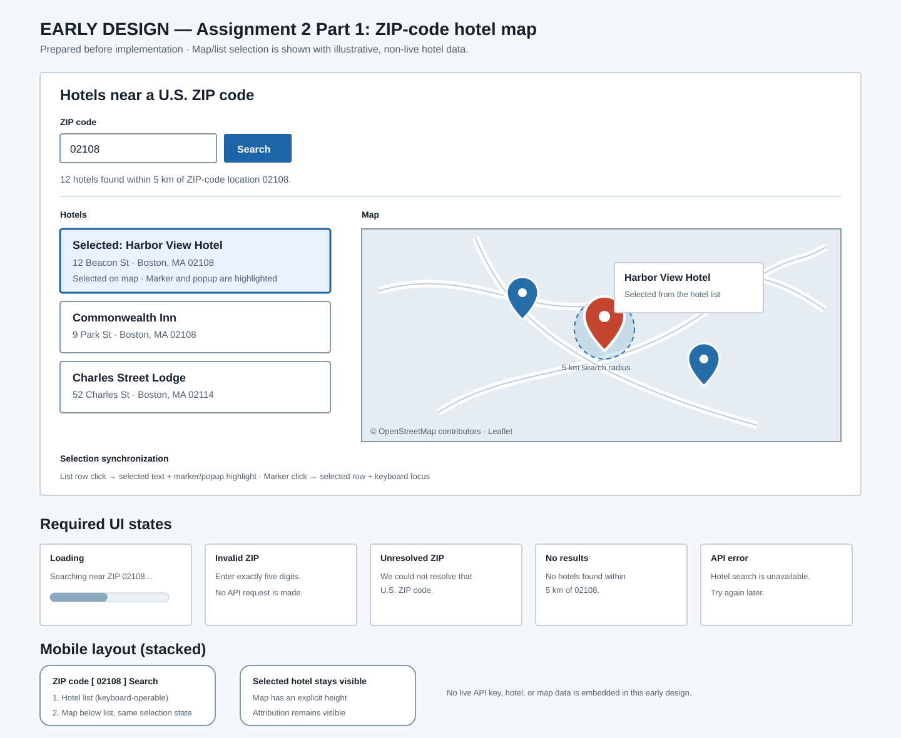

# Assignment 2 Part 1 — ZIP-Code Geo Hotel Map

## Repository and assessment status

- Repository: [travelbooking-app](https://github.com/clarissaalessi1-creator/travelbooking-app)
- Working branch: `assignment-2-part-1-geo-hotel-map`
- Assessed Assignment 2 Part 1 commit: **TBD — no Assignment 2 Part 1 commit has been created yet.**
- Current inherited repository commit: `0fb1d44` — Final Part 2 report.

The Assignment 1 history and existing local search, bookings, and SQLite data remain in the repository. Relevant preserved checkpoints are `ade03d9` (Part 1 checkpoint), `e630c44` (Part 2 implementation), and `0fb1d44` (Final Part 2 report). This report documents only the new Assignment 2 Part 1 ZIP-code hotel-map work.

## Part 1 implementation

The application adds a live hotel discovery search for an exactly five-digit U.S. ZIP code. It is discovery-only: it does not add a shortlist, booking workflow, prices, ratings, room availability, or booking claims.

- `GET /api/nearby-hotels?zip_code=<ZIP>` validates the ZIP while retaining leading zeroes.
- FastAPI uses the server-only `GEOAPIFY_API_KEY` to forward-geocode the requested ZIP, restricts candidates to the United States, and verifies the returned postcode matches the requested value before using its coordinates as the Places search center.
- The Places request uses `accommodation.hotel` and a 5 km circle, limits displayed provider results to 20, and returns only available provider fields: provider place ID, name when supplied, address/location fields when supplied, and coordinates.
- The response distinguishes invalid input, unresolved ZIP, no nearby hotels, authentication failure, quota/rate-limit failure, configuration failure, and other upstream API failure. Empty results are not used to disguise an API failure.
- Vue provides the ZIP form, loading/error/result states, accessible hotel-list controls, and a Leaflet/OpenStreetMap map. The list and map share one `selectedPlaceId`: selecting a list item opens/selects its marker, and selecting a marker selects the same list item.
- The interface says that results are not necessarily an exhaustive inventory of hotels within the area. If the provider omits a hotel name, the UI says “Hotel name unavailable from provider.” rather than creating one.

Assignment 2 Part 2 shortlist functionality is intentionally not implemented.

## Startup and local configuration

The Geoapify key is a local secret. Create or open `backend/.env` (which is ignored by Git) and enter the value only there:

```dotenv
GEOAPIFY_API_KEY=your_key_here
```

Do not put the real key in `backend/.env.example`, frontend files, browser configuration, committed files, or this report. The tracked example deliberately contains only `GEOAPIFY_API_KEY=`.

From the repository root, start the backend in one terminal:

```bash
cd backend
source .venv/bin/activate
uvicorn main:app --reload --host 127.0.0.1 --port 8000
```

Start the Vue development server in another terminal:

```bash
cd frontend
npm run dev
```

Open the local URL reported by Vite (normally `http://127.0.0.1:5173/`). The frontend calls the local FastAPI service; the Geoapify key is never sent to the browser.

## Research and early design

The pre-implementation research is recorded in [docs/assignment2-research.md](docs/assignment2-research.md). It covers Geoapify forward geocoding, exact postcode verification, Places category/radius parameters, response-field omissions, API failure/rate-limit handling, Leaflet attribution and selection behavior, and interaction patterns. It includes source URLs, including the [Geoapify Geocoding API documentation](https://apidocs.geoapify.com/docs/geocoding/forward-geocoding/), [Geoapify Places API documentation](https://apidocs.geoapify.com/docs/places/), and [Leaflet quick-start guide](https://leafletjs.com/examples/quick-start/).

The early pre-implementation design is [docs/assignment2-early-design-mockup.svg](docs/assignment2-early-design-mockup.svg).



The mockup established the five-digit input, all outcome states, two-column list/map layout, synchronization, attribution, and mobile stacking before coding. During implementation, the provider-data presentation was tightened: a provider's formatted address is no longer reused as a hotel name when `name` is absent; the UI explicitly states that the name is unavailable. The final UI also keeps raw provider IDs out of the visible hotel list while retaining them for selection synchronization.

## Screen-recorded demonstration

[Screen Recording — September 30, 2026](https://pennstateoffice365-my.sharepoint.com/:v:/r/personal/cca5290_psu_edu/Documents/Screen%20Recording%202026-09-30%20at%2010.01.38%E2%80%AFPM.mov?d=w06feb5976f0345ff80034920bc4e1093&csf=1&web=1&nav=eyJyZWZlcnJhbEluZm8iOnsicmVmZXJyYWxBcHAiOiJPbmVEcml2ZUZvckJ1c2luZXNzIiwicmVmZXJyYWxBcHBQbGF0Zm9ybSI6IldlYiIsInJlZmVycmFsTW9kZSI6InZpZXciLCJyZWZlcnJhbFZpZXciOiJNeUZpbGVzTGlua0NvcHkifX0&e=Z6vk4U)

## Verification record

Manual live verification was completed on September 30, 2026. The source/provider data can change over time; the observations below are for the listed date and test ZIP.

| Verification mode and date | Input or action | Expected | Observed | Correction, limitation, or note |
| --- | --- | --- | --- | --- |
| Manual live — 2026-09-30 | Search `02108` | A valid leading-zero ZIP resolves to the exact requested U.S. ZIP and finds nearby provider hotels. | FastAPI returned HTTP 200 with `outcome: success`; `02108` was verified as the requested U.S. ZIP/postcode. Geoapify's returned location was used as the center and 20 provider hotel results were returned from the configured 5 km search. | Results are capped at 20 and are explicitly not an exhaustive inventory. |
| Manual live — 2026-09-30 | Review `02108` results in the Vue UI | Provider hotels appear in a list and on the Leaflet map with visible attribution. | Results appeared in both places; Leaflet/OpenStreetMap attribution and the non-exhaustive-inventory notice were visible. | Tile/provider content is live and may vary later. |
| Manual live — 2026-09-30 | Click a hotel list item, then a different marker | List and map represent one selected provider place. | The list selection opened/selected the corresponding marker; clicking another marker selected the corresponding hotel in the list. | Selection uses one provider place identifier, not an invented local ID. |
| Manual live — 2026-09-30 | Inspect returned/provider-presented fields | Missing provider values are handled honestly; no booking-like facts are invented. | One provider result without a name displayed “Hotel name unavailable from provider.” No prices, ratings, availability, rooms, or booking claims appeared. | The application only presents fields supplied by the provider. |
| Manual live — 2026-09-30 | Submit `1234` | Reject a non-five-digit ZIP with a clear message and remove stale map/results. | The UI displayed “Enter exactly five digits for a U.S. ZIP code.” The previous hotel results and map were cleared. | Client validation is paired with backend validation. |
| Manual live — 2026-09-30 | Inspect secret handling | The local key is not tracked or shown. | `backend/.env` remained ignored and untracked; the key was not exposed. | The actual value is intentionally omitted from all evidence. |
| Automated/simulated — local focused tests | Run `PYTHONDONTWRITEBYTECODE=1 .venv/bin/python -m unittest -v test_nearby_hotels.py` from `backend/` | Exercise response outcomes without consuming the live provider service. | Eight focused tests passed. Mocked scenarios cover a valid leading-zero ZIP, invalid ZIP, unresolved ZIP, no results, a missing provider name, generic API failure, authentication failure, and rate-limit failure. | These are simulated upstream responses, not live Geoapify tests. |
| Automated — local build | Run `npm run build` from `frontend/` | Produce a production Vue bundle. | Build completed successfully. | Leaflet's bundle-size notice is informational. |
| Automated — repository check | Run `git diff --check` | Detect whitespace errors in the pending changes. | Completed without whitespace errors. | This does not create a commit. |

### Revisions made from verification

- The ZIP form originally retained native browser `pattern` validation, which could prevent the intended Vue error text from appearing. The form was revised to use `novalidate` so `1234` reaches the explicit application message documented above.
- A preliminary provider-field mapping could have treated a formatted address as a hotel name. It was revised after review so a missing provider `name` remains missing and the UI uses the honest unavailable-name message instead.

## AI disclosure and evidence log

The implementation and documentation work were assisted in an OpenAI Codex desktop session. The factual tool/environment statement available for this report is “OpenAI Codex desktop app.” The exact AI model identifier is **not recorded in the repository or available session evidence used for this report and needs confirmation**; no model name is asserted here. [OpenAI's Codex documentation](https://developers.openai.com/learn/codex) describes the product, but it does not establish the model used for this particular local session.

Selected request excerpts and their traceable effects are below. These are excerpts, not claims that AI output was accepted without review.

| Request excerpt | Resulting reviewed work/evidence |
| --- | --- |
| “Add a new live hotel search based on a five-digit U.S. ZIP code.” | `backend/main.py` implements the nearby-hotels endpoint and `frontend/src/App.vue` adds the ZIP search workflow. |
| “use Geoapify geocoding to resolve the requested ZIP” and “query Geoapify Places for hotels within 5 km” | Backend request construction, response outcome handling, and the research notes document the provider calls and 5 km limit. |
| “never expose the key to Vue or an API response” | `backend/.env.example`, `.gitignore` behavior, backend-only environment loading, and secret checks document the configuration boundary. |
| “Synchronize list and map using one selectedPlaceId” | Vue list buttons and Leaflet marker handlers use the same selection state; manual live verification recorded both directions. |
| “Do not claim the returned hotels are an exhaustive inventory.” | The UI notice, research notes, and this report state the limitation. |

The evidence log in [docs/evidence-log.md](docs/evidence-log.md) records the planned and observed verification commands and outcomes. The revised native-validation behavior and missing-name mapping above are factual examples of a failed or inadequate initial approach that was corrected before the final manual demonstration.

## Security and configuration notes

- `backend/.env` is local, ignored, and untracked; `backend/.env.example` contains no secret.
- The backend loads `GEOAPIFY_API_KEY` only from its local environment and does not include it in JSON responses or frontend configuration.
- The frontend contains no Geoapify API-key configuration; provider calls occur through FastAPI.
- A missing key produces a configuration outcome rather than a fabricated result. Authentication, rate-limit, and other provider failures remain distinct outcomes.
- No actual API key is printed in this report, source excerpts, test output, or version-controlled configuration.

## Current limitations

- Hotel inventory and field completeness depend on Geoapify's live provider data and may change after the September 30, 2026 observation.
- The 20-result display cap and 5 km circle mean the list is useful nearby-provider data, not an exhaustive hotel inventory.
- Assignment 2 Part 2 shortlist functionality is intentionally out of scope.
- An Assignment 2 Part 1 commit hash must be added after the reviewed changes are committed.
